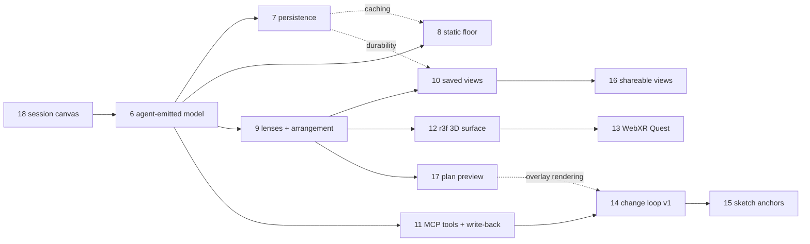

# EPIC — The software model: understanding and changing code inside a session

**Status:** Active · **Owns:** the *depth* half of [the vision](../docs/vision.md) — the software
model, lenses, arrangement, and the change loop, as specified in
[software-model.md](../docs/software-model.md) · **Updated:** August 29, 2026 ·
**Rewritten:** August 29, 2026, after the analyzer archive and the arena vision

This is the plan of record for making CodeAI *understand* software, not just converse about it. The
[software model chapter](../docs/software-model.md) says *where* and *why*; this epic says *what,
when, and after what*. Each proposed story below gets a full spec ([TEMPLATE](TEMPLATE.md)) only
when it is picked up — here it carries just enough to sequence it.

## What this epic does not own

The product now has two halves ([vision.md](../docs/vision.md)), and three documents used to claim
overlapping authority over both. The split, stated once:

- **Breadth — the arena** (many sessions, states, the Inbox, machines, devices, cloud) is sequenced
  by [vision.md's steps](../docs/vision.md#sequence), executed through the
  [web2 operational collaboration epic](EPIC-20260806-web2-operational-collaboration.md).
- **Depth — understanding one piece of software** is this epic.
- **Naming** for both is [vocabulary.md](../docs/vocabulary.md). This epic's prose predates it in
  places; *thread* means **session** and *project* means **repository** wherever old story titles
  are quoted.

The two halves meet in one place: a session is where a model is built and read, so everything here
lands inside the session surface the other track builds.

---

## The question this epic has to answer first

[Story 24](STORY-20260820-promote-next-app-archive-legacy.md) archived the analyzer runtime under
[`legacy/`](../legacy/README.md). That was right for the product and it invalidated this epic's
original Phases A and B, which sequenced work against code the root application does not build,
start, or import. Concretely: `Entity`, `Relation`, the identity scheme in
[entityId.ts](../legacy/server/src/model/entityId.ts), the `Arrangement` spec, and the LLM client all
exist **only under `legacy/`**. In `src/` there is no model, no extractor, and no lens.

So the model has no producer, and the plan cannot resume until one is chosen. Three candidates:

| Source | What it buys | What it costs |
|---|---|---|
| **Port the static analyzer** out of `legacy/` | Exact, fast, `origin: 'static'` facts; the provenance floor the credibility principle rests on | JS/TS only; the largest net-new integration; re-litigates decisions made for a runtime that no longer exists |
| **Agent-emitted** — sessions already run an agent in the repository; have it emit typed entities and relations beside the Mermaid it authors | Reuses the entire existing runtime; breadth across every language on day one; matches *agents enrich the model as a side effect* | Everything is `origin: 'llm'` with a confidence, so provenance honesty has no `static` half to contrast against |
| **A separate LLM extraction pass** (the legacy `LlmClient` ported) | Independent of the conversation; schedulable and cacheable | A second model client beside the agent that is already there, paid for, and authenticated |

**This epic takes the agent-emitted path first, with the static port as the follow-on.** The agent
is already running in the repository with file access, its own tools, and the user's own
subscription; asking it for structure costs one output contract rather than a new subsystem, and it
produces a model for repositories no analyzer of ours will ever cover. The static port then lands
underneath it (Story 8) to restore the exact/heuristic contrast that
[principle 1](../docs/software-model.md#principles) depends on — by which point the model's shape
has been proven by real use rather than guessed.

**What would flip it:** if agent-emitted entities prove too unstable to merge across turns — ids
churning, the same function arriving under three names — then identity is doing the work no
extractor can fake, and Story 8 moves ahead of Story 6.

**Sequencing principles** (from the vision, applied):

1. Read-only understanding before acting — the change loop waits until the model and its lenses have
   proven themselves.
2. Every story is shippable on its own; no story strands the product in a half-state.
3. LLM discipline everywhere: opt-in, cached, fail-safe, never blocking the surface the user is
   looking at.
4. **Mermaid stays the canonical diagram source.** A lens emits Mermaid, so every model view reuses
   the canvas, annotations, pins, and drawing that already exist. A native renderer is an
   optimization, not a prerequisite ([the notes](../docs/multi-project-session-environment.md#mermaid-across-2d-and-3d)).
5. The **VR/3D surface is a differentiator, not a curiosity** — and it now serves both halves: the
   same renderer places a model in space and, later, the arena's sessions around you. Code-split
   modes inside the root application; no separate spatial product to keep in sync.

---

## Story map

### Existing stories

| # | Story | Status today |
|---|---|---|
| 1 | [review-card-declutter](STORY-20260602-review-card-declutter.md) | **Shipped** into the archived runtime; its per-item content + description UI is the reference design for the model card, not running code |
| 2 | [llm-review-annotation](STORY-20260602-llm-review-annotation.md) | **Split three ways** — client → Story 4; annotation pass → folded into Story 6's `description` facet; `narrativeRank` superseded by the `Arrangement` spec |
| 3 | [static-entity-relation-model](STORY-20260603-static-entity-relation-model.md) | **Shipped**, into a runtime since archived. Its `Entity`/`Relation` shape and identity scheme live under `legacy/`; Story 6 ports the *types* and Story 8 the *extractor* |
| 4 | [provider-agnostic-llm-client](STORY-20260604-provider-agnostic-llm-client.md) | **Shipped into `legacy/`.** The root app reaches models through the agent CLIs instead; the client is a reference for the day a non-conversational pass needs one |
| 5 | [llm-arrangement-pass](STORY-20260605-llm-arrangement-pass.md) | **Superseded** — 13 of 14 criteria met; the empirical side-by-side signal needed the archived Review lens. The `Arrangement` contract (regions, visibility, order, emphasis) and its unmeasured bet are what Story 9 inherits |
| 18 | [web2-conversational-agent-canvas](STORY-20260805-web2-agent-mermaid-canvas.md) | **In progress** — the surface every story below lands in |
| 24 | [promote-next-app-archive-legacy](STORY-20260820-promote-next-app-archive-legacy.md) | **Shipped** — one product at the repository root; the visualizer runtime archived |
| 25 | [next-16-npm-toolchain](STORY-20260821-next-16-npm-toolchain.md) | **Shipped** |
| — | [change-focused-review-view](STORY-20260501-change-focused-review-view.md) · [homepage-code-map-lenses](STORY-20260514-homepage-code-map-lenses.md) · [code-map-layout-strategies](STORY-20260520-code-map-layout-strategies.md) | Ancestors: the review slice, the lens shell, and the algorithmic/user arrangement sources — archived, still the best written record of each |

Stories 19–23 and 26–36 belong to the other track and are sequenced by the
[web2 operational collaboration epic](EPIC-20260806-web2-operational-collaboration.md).

### Proposed stories (to be written)

Numbers 6–17 are **reserved placeholders** assigned when a story is picked up; other tracks number
from 36 upward. Several are referenced by number from the other epic, so the meanings below are
stable even as the content is rescoped.

| # | Story (working title) | Depends on |
|---|---|---|
| 6 | Model records and their first producer — agent-emitted entities and relations | 18 |
| 7 | Persist and cache the model per repository | 6 |
| 8 | Static extractor floor — port the JS/TS analyzer for `origin: 'static'` | 6, (7 for caching) |
| 9 | Lenses and arrangement on the canvas — feature focus, relation-kind filters | 6, (7), (5's spec) |
| 10 | Saved views and notes | 9, (7 for durability) |
| 11 | Model-as-tools MCP server, and agent write-back | 6, (7 amortizes it) |
| 12 | 3D renderer inside the root app — react-three-fiber | 9 |
| 13 | Immersive mode — WebXR on Quest, same root app | 12 |
| 14 | Change loop v1 — intent → agent → proposed overlay | 11, 17 |
| 15 | Draw-over-diagram — sketch anchors | 14, 17, (12 for spatial input) |
| 16 | Shareable views — the async half of the team surface | 10 |
| 17 | Plan preview — spec/story/plan document → proposed-change overlay | 6, 9 |

---

## Phases

### Phase A — Re-found the model on the running product (now)

The model has to exist inside CodeAI before anything can be built on it. Everything here lands in
the session surface, and nothing imports `legacy/`.

- **Story 6 — Model records and their first producer.** Port the `Entity` / `Relation` types and the
  identity scheme from `legacy/` into `src/shared/`, and give them a producer: an agent turn may emit
  typed entities and relations alongside its Mermaid, captured into a per-repository model with
  `origin: 'llm'` and a confidence. Merge by stable id across turns. Fail-safe in both directions — a
  turn that emits nothing still works, and a malformed emission is dropped, never partially merged.
  Story 2's pending annotation pass folds in here as the `description` facet, produced by the same
  agent that produced the entity.
- **Story 7 — Persist and cache the model.** One model record per repository checkout in the host
  store, revisioned and written under the same lock discipline as sessions. Invalidation is keyed by
  file, and the first honest answer for "what changed" is git, not a watcher. Prerequisite for
  amortizing model cost across sessions — and the point where the model stops being a per-session
  artifact and becomes something the arena can show.
- **Story 9 — Lenses and arrangement on the canvas.** A lens is a query over the model that emits
  Mermaid, so it renders through the canvas that already exists: *overview*, *feature focus*, and
  relation-kind filters ("only the data layer", "only client↔server"). Story 5's `Arrangement` spec
  — regions, initial visibility, order, emphasis — is realized here, with a deterministic layout
  always available as the fallback.

**Exit:** working in a repository leaves it more understood than it was; a lens over the accumulated
model renders on the canvas without an agent turn.

### Phase B — The model earns its keep

- **Story 8 — Static extractor floor.** Port the JS/TS analyzer into `src/server/model/` so
  structural facts arrive as `origin: 'static'` and merge with the agent's `llm` facts by id. This is
  what restores the exact/heuristic contrast the credibility principle needs, and it is also the
  first real test of the identity scheme: two producers, one merge key.
- **Story 11 — Model-as-tools MCP server, and write-back.** Expose the model to agents as a few sharp
  tools — *who-calls*, *what-does-this-expose*, *slice-around-X* — so a session reads the
  pre-digested graph instead of grepping, and its discoveries flow back as `origin: 'llm'` relations.
  The loop closes: the model makes agents cheaper, and agents make the model richer.
- **Story 17 — Plan preview.** Render a written plan — a `stories/*.md`, a design spec, an agent's
  plan output — as a `changePhase: 'proposed'` overlay anchored to the live model, before anything is
  implemented. References to real code resolve to existing ids; genuinely new parts become proposed
  nodes. This adds the proposed-overlay rendering with the simplest possible producer, so Story 14
  later adds only delegation. Dogfood it on this epic.

**Exit:** a multi-source model with honest provenance; an agent that reads it instead of re-deriving
it; a plan verifiable on the map before code exists.

### Phase C — Surfaces and memory (parallel; can start during Phase B)

Everything here consumes model, lens, and arrangement output and touches no producer code.

- **Story 12 — 3D renderer (react-three-fiber).** A code-split spatial renderer inside the root
  application, rendering the same artifact the 2D canvas does: entities as nodes, regions as
  volumes, provenance as material (solid = static, translucent = suggested). Desktop browser first.
  The third dimension is budget for what the 2D map crowds — depth for layers, elevation for change
  overlays.
- **Story 13 — Immersive mode (WebXR, Quest).** `@react-three/xr` as a further mode of the same
  application, opened in the headset browser, no store app. Quest 2 performance is the design
  constraint, and the mitigation is editorial: the same visibility discipline that makes a 2D map
  readable makes a 3D one renderable. This is also where the arena's spatial form
  ([vision.md step 9](../docs/vision.md#sequence)) gets its renderer.
- **Story 10 — Saved views and notes.** A view = lens + scope + arrangement + viewport + notes,
  serialized; notes attach to entities, regions, or the view. Cheap because the arrangement is a spec
  rather than pixels. A restored view doubles as an agent context pack through Story 11's tools, and
  the viewport includes the 3D camera, so a saved view restores in the headset too.

**Exit:** the map is bookmarkable and annotatable; the product demos in a headset.

### Phase D — Acting (the bidirectional loop)

- **Story 14 — Change loop v1.** Intent attached to a scope → delegate to the session's own agent
  through Story 11's tools → render the returned diff as a `changePhase: 'proposed'` overlay on the
  rendering path Story 17 proved → apply or export. No autonomous apply.
- **Story 15 — Sketch anchors.** Boxes and arrows drawn over the diagram become `origin: 'user'`
  proposed entities and relations that generation treats as fixed points
  ([the chapter](../docs/software-model.md#user-drawings-as-anchors)). Touch-drawing on a tablet and
  drawing in space in a headset are the same structured intent.
- **Story 16 — Shareable views.** Serialized views and notes exported, imported, or linked; async
  design review on a live map. The rest of the team surface — several people in one session — belongs
  to the arena track, not here.

**Exit:** see, understand, express intent, verify a proposal, apply — end to end.

---

## What is deliberately not scheduled

- **A native agent loop of our own** — the session's `claude`/`codex` is the executor; the
  `CodeAgent` abstraction keeps the option open without committing to it.
- **Real-time multiplayer** — Story 16 is async sharing; live collaboration is the arena track's
  problem and is deferred there too.
- **Per-language static analyzers** beyond JS/TS — the agent is the breadth path.
- **A native 2D diagram renderer** replacing Mermaid — allowed by principle 4, not planned.
- **Voice input** — after sketch anchors prove the structured-intent path.

## Risks to watch

1. **Agent-emitted identity churns** (Story 6). The same function arriving under different ids across
   turns poisons every merge downstream. This is the epic's central bet; measure id stability on a
   repeated pass over the same repository before building Story 7 on top of it. Mitigation is the
   flip described above — pull Story 8 forward and let static facts carry identity.
2. **The model is never worth the tokens** (Phase A). If a lens over the accumulated model is not
   more useful than asking the agent again, the model is a cache with a maintenance cost. Story 9 is
   deliberately early so this is answerable before Stories 7, 8, and 11 invest in it.
3. **Provenance reads as certainty** (Story 6 until Story 8). With only `llm` facts, everything on
   the map is a suggestion, and a map of suggestions that *looks* structural violates the credibility
   principle. Until the static floor lands, the rendering must lean visibly editorial.
4. **MCP surface sprawl** (Story 11) — a few sharp tools beat a generic graph API nobody can prompt
   against.
5. **Quest performance** (Story 13) — cap immersive mode to Quest 3-class devices before compromising
   the model.
6. **Plan-preview anchoring is too noisy** (Story 17) — validation rejects nonexistent anchors, not
   wrong-but-existing ones. Ship suggested-only; if precision stays low it degrades to unanchored
   proposed nodes grouped by region, which is still a useful shared sketch.
