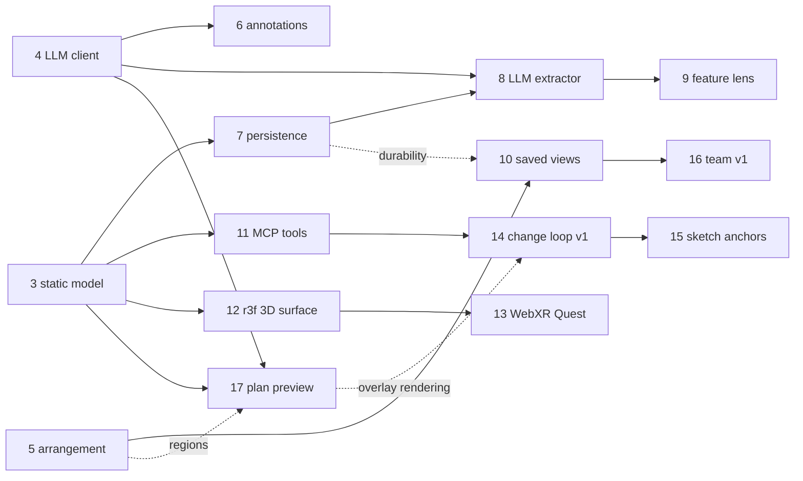

# EPIC — From read-only visualizer to the north star

**Status:** Active · **Owns:** the sequencing of all stories toward the
[vision](../docs/vision.md) · **Updated:** August 5, 2026

This is the plan of record for reaching the [vision & north star](../docs/vision.md): which
stories exist, which are still to be written, what depends on what, and in what order the work
lands. The vision says *where* and *why*; this epic says *what, when, and after what*. Each
proposed story below gets a full spec ([TEMPLATE](TEMPLATE.md)) only when it is picked up —
here it carries just enough to sequence it.

**Sequencing principles** (from the vision, applied):

1. Read-only understanding before acting — the change loop waits until the model, lenses, and
   arrangement have proven themselves.
2. Every story is shippable on its own; no story strands the product in a half-state.
3. LLM discipline everywhere: opt-in, cached, fail-safe, never blocking the structural view.
4. The **VR/3D surface is a differentiator, not a curiosity** — adjacent tools (editor + agent
   CLIs, classic diagram tools) have no credible spatial surface. It runs as a parallel track
   because the surface-agnostic boundary makes it purely additive: it consumes the same
   model / lens / arrangement JSON as the 2D web app.

---

## Story map

### Existing stories

| # | Story | Arc step | Status |
|---|---|---|---|
| 1 | [review-card-declutter](STORY-20260602-review-card-declutter.md) | 6 (seed) | **Shipped** |
| 2 | [llm-review-annotation](STORY-20260602-llm-review-annotation.md) | — | **Split three ways** — client → Story 4; annotation pass → Story 6; `narrativeRank` superseded by Story 5 |
| 3 | [static-entity-relation-model](STORY-20260603-static-entity-relation-model.md) | 1 | **In progress** — core landed (MVP M1) |
| 4 | [provider-agnostic-llm-client](STORY-20260604-provider-agnostic-llm-client.md) | — (foundation) | **Shipped** — built & verified |
| 5 | [llm-arrangement-pass](STORY-20260605-llm-arrangement-pass.md) | 5 | **In progress** — core landed; empirical side-by-side signal open (MVP M2) |
| 18 | [web2-conversational-agent-canvas](STORY-20260805-web2-agent-mermaid-canvas.md) | 7–8 experiment | **Draft** — canvas-first multi-turn agent workspace with optional Mermaid artifacts and drawing attachments; informs Stories 14–15 |
| — | [js-analyzer-improvement](STORY-20251111-js-analyzer-improvement.md) · [socket-io-improvements](STORY-20251111-socket-io-improvements.md) | pre-vision | Legacy groundwork |
| — | [change-focused-review-view](STORY-20260501-change-focused-review-view.md) · [homepage-code-map-lenses](STORY-20260514-homepage-code-map-lenses.md) · [code-map-layout-strategies](STORY-20260520-code-map-layout-strategies.md) | ancestors | Shipped groundwork (review slice, lens shell, layout/arrangement sources) |

The continuation of the `web2` track (Stories 19–21: operational modes, multi-agent roles,
team environment) is sequenced by its own
[web2 operational collaboration epic](EPIC-20260806-web2-operational-collaboration.md); it
feeds Stories 14–16 here.

### Proposed stories (to be written)

| # | Story (working title) | Arc step | Depends on |
|---|---|---|---|
| 6 | Annotation pass — produce `summary` / `causalReason` | 6 | 4 |
| 7 | Persist & cache the model | 2 | 3 |
| 8 | Extractor pipeline + LLM extractor — client↔server API vertical | 3 | 3, 4, (7 for caching) |
| 9 | Feature focus lens + relation-kind filters | 4 | 8 |
| 10 | Saved views & notes (workspace memory) | 9 | 5, (7 for durability) |
| 11 | Model-as-tools MCP server | agent-first | 3, (7 amortizes it) |
| 12 | 3D surface bootstrap — react-three-fiber | VR track | 3 |
| 13 | Immersive mode — WebXR on Quest | VR track | 12 |
| 14 | Change loop v1 — intent → external agent → proposed overlay | 7 | 11, 17 (overlay rendering) |
| 15 | Draw-over-diagram — sketch anchors | 8 | 14 (loop), 17 (overlay rendering), 12 (spatial input later) |
| 16 | Team surface v1 — shareable views | 10 | 10 |
| 17 | Plan preview — spec/story/plan doc → proposed-change overlay | 7 (seed) · 8 | 3, 4, (5 for regions) |

Dependency shape (arrows = "needs"):

---

## Phases

### Phase A — Finish the MVP (now)

Close out both MVP milestones and the loose ends the vision already names.

- **Story 3** — finish M1: richer facets (per-facet `origin`, `traits`, lazy `content`).
- **Story 5** — close M2: the **empirical side-by-side signal** (success criterion #4 — a
  number, e.g. timed locate-task or N-of-M preference, not just "looks better").
- **Story 6 — Annotation pass** *(new)*: the still-pending third of Story 2. Produce
  `summary` / `causalReason` via the Story 4 client (the fields already render). Small,
  high-visibility, pure reuse of existing plumbing. Also remove the dead `narrativeRank` field
  from both type files.

**Exit:** both vision bets validated with evidence; review lens cards show real descriptions.

### Phase B — The model becomes real (understanding deepens)

The persistent model is the center of the vision; this phase builds it, proves multi-source
extraction, and extends understanding from what *is* to what is *proposed*.

- **Story 7 — Persist & cache the model** (arc 2): on-disk store per project (open question #2:
  `~/.code-ai/projects/{...}/`), invalidated by the existing chokidar watch, file-level
  granularity first. Prerequisite for amortizing LLM cost and cross-file relations.
- **Story 8 — Extractor pipeline + LLM extractor** (arc 3): turn `getAnalyzer(ext)` into a
  pipeline of extractors merged by stable id; add the LLM extractor; prove the
  **client↔server API vertical** end-to-end (`api-endpoint` / `api-call` entities, `consumes`
  edge with `origin: 'llm'` + confidence).
- **Story 11 — Model-as-tools MCP server** (agent-first-class): expose the model as MCP tools —
  *who-calls*, *what-exposes*, *slice-around-X* — so an external Claude Code/codex session reads
  the pre-digested graph instead of grepping. Can start against the in-memory model; Story 7
  makes it fast. This is also the hand-off substrate the change loop (Story 14) needs, and where
  **agents enrich the model as a side effect** (write-back of discovered relations) lands.
- **Story 9 — Feature focus lens + relation-kind filters** (arc 4): seed entities + semantic
  neighborhood; "show only the DB layer / only client↔server API" filters — the payoff of typed
  relations.
- **Story 17 — Plan preview: spec/story/plan doc → proposed-change overlay** (arc 7 seed · 8):
  render a written plan — a `stories/*.md`, a design spec, an agent's plan output — on the live
  map *before anything is implemented*. One scoped completion pass (no delegation, no apply)
  parses the doc into proposed entities/relations anchored to the current model: references to
  real code resolve to existing entity ids (`changeStatus: 'modified'`), genuinely new parts
  become proposed-new nodes with session-stable ids (open question #4 in its low-stakes form).
  Rendering is pure reuse of the review visualization — this story adds the deferred
  `changePhase: 'proposed'` field (both type files) and its visual treatment, making the
  vision's "same rendering, different phase" insight real; impact comes free from the review
  lens's existing neighborhood expansion, and arrangement regions (Story 5) group the plan into
  its chapters. Discipline as always: pre-narrow deterministically ("send only relevant
  changes"), validate anchors against the model, render as *suggested* — validation catches
  nonexistent anchors, not wrong-but-existing ones, so provenance rendering does the safety work
  (non-goal #3). **Why here, not Phase D:** its dependencies (3, 4) are already met; it moves
  verification to the earliest point in the loop — the plan, before any code exists — and it
  builds the proposed-overlay rendering with the simplest possible producer, so Story 14 later
  adds only delegation. Dogfood: point it at this epic.

**Exit:** a persisted, multi-source model; an agent can query it cheaply; one cross-cutting
vertical demonstrably beyond files/functions/calls; a written plan renders as a proposed overlay
anchored to the live map.

### Phase C — Surfaces & memory (parallel track, can start during Phase B)

The differentiator track plus workspace memory. Deliberately parallelizable: everything here
consumes model/lens/arrangement output through the existing API and touches no extraction code.

- **Story 12 — 3D surface bootstrap (react-three-fiber)**: replace the `web3d` stub with an r3f
  app rendering the same lens output as the 2D web app — entities as spatial nodes, regions as
  volumes/platforms, provenance as material (solid = static, translucent/wireframe = suggested).
  Shares `types.d.ts` and the websocket API; desktop-browser 3D first (orbit, select, expand).
  The third dimension is not decoration — it is budget for what the 2D map crowds: depth for
  architectural layers, elevation for change overlays.
- **Story 13 — Immersive mode (WebXR on Quest 2/3)**: `@react-three/xr` on top of Story 12;
  served over the network, opened in the headset browser — no store app. Controller
  ray-pointing for select/expand, grab to move regions (`origin: 'user'` placement, same
  precedence rules as 2D drags). **Quest 2 perf is the design constraint**: lens + arrangement
  visibility already bound the slice size — the same editorial discipline that makes the 2D map
  readable makes the 3D one renderable. Walking through your codebase at room scale is the demo
  no adjacent tool can give.
- **Story 10 — Saved views & notes** (arc 9): view = (lens + scope + arrangement + viewport +
  notes), serialized; notes attach to entities/regions/views. Session-scoped works after
  Story 5; durable across restarts once Story 7 lands. A restored view doubles as an agent
  **context pack** through Story 11's tools. Viewport serialization includes the 3D camera —
  a saved view restores in 2D *and* in the headset.

**Exit:** the map is bookmarkable and annotatable; the product demos in a Quest headset.

### Phase D — Acting (the bidirectional loop)

Understanding is proven; now the map drives change.

- **Story 14 — Change loop v1** (arc 7, source ladder rung 1 — complementary): intent (text
  first) attached to a scope → delegate to an installed `claude`/`codex` via Story 11's MCP
  hand-off → render the returned diff as a `changePhase: 'proposed'` overlay — the rendering
  path Story 17 already proved on the review visualization → apply via `saveFile` or export.
  No autonomous apply (non-goal #2).
- **Story 15 — Sketch anchors** (arc 8): draw boxes/arrows over the diagram → `origin: 'user'`
  proposed entities/relations → generation treats them as anchors
  ([vision](../docs/vision.md#user-drawings-as-anchors)). Touch-draw on tablet and — the
  differentiator again — **drawing in space in the headset** are the same structured intent.
- **Story 16 — Team surface v1** (arc 10): shareable serialized views/notes (export/import or
  URL first, no realtime); async design review on a live map.

**Exit:** the vision's core loop — see, understand, express intent, verify a proposal, apply —
works end-to-end with an external agent.

---

## What is deliberately not scheduled

- **Full native agent loop** (source ladder rung 3) — kept open by the `CodeAgent` abstraction,
  not committed to.
- **Real-time multiplayer** — Story 16 is async sharing only (vision non-goal #6).
- **Per-language static analyzers** beyond JS/TS — the LLM extractor (Story 8) is the breadth
  path (vision non-goal #4).
- **Voice input** — after sketch anchors prove the structured-intent path.

## Risks to watch

1. **The arrangement bet fails its measurement** (Phase A): if the arranged map is *not*
   measurably clearer, Phases B–D still stand (they lean on the model, not the arrangement),
   but the LLM-editorial ambition shrinks. Measure early; that is why the signal closes Phase A.
2. **Quest 2 performance** (Story 13): mitigation is editorial (small slices, aggressive
   collapse), not heroic rendering work. If a review slice cannot hit frame rate on Quest 2,
   cap immersive mode to Quest 3-class devices before compromising the model.
3. **Identity scheme cracks under persistence** (Story 7): renames/moves churning ids would
   poison the cache and saved views. Open questions #4/#11 get answered here, at the latest.
4. **MCP surface sprawl** (Story 11): a few sharp tools (slice, who-calls, exposes) beat a
   generic graph-query API nobody can prompt against.
5. **Plan-preview anchoring is too noisy** (Story 17): mapping prose to real entities can
   mis-resolve — validation rejects nonexistent anchors but not wrong-but-existing ones. Ship it
   suggested-only (non-goal #3) and measure it like the arrangement bet; if precision stays low,
   it degrades to unanchored proposed nodes grouped by region — still a useful shared sketch,
   not a broken map.
