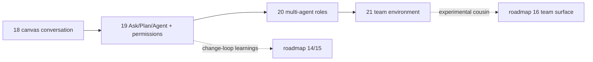

# EPIC — web2 operational collaboration: one agent that builds → agent roles → team

**Status:** Active · **Owns:** the sequencing of the `web2` conversation track from read-only
explainer to a collaborative multi-agent, multi-human workspace · **Updated:** August 6, 2026

[Story 18](STORY-20260805-web2-agent-mermaid-canvas.md) proved the surface: a canvas-first,
session-persistent conversation over a local repository with a read-only agent. This epic owns
what comes next on that track: making the conversation **operational** (modes, git history,
permissioned building), then **multi-agent** (roles, cross-vendor peer review), then **multi-
human**. Each proposed story gets a full spec ([TEMPLATE](TEMPLATE.md)) when it is picked up;
Stories 20–21 currently carry sequencing-level drafts only.

Relation to the [north-star roadmap](EPIC-20260705-north-star-roadmap.md): `web2` remains the
experimental parallel track. Story 19 feeds the change-loop learnings of roadmap Stories
14–15 (intent → agent → proposed change, plan preview); Story 20's roles and hand-offs inform
the same; Story 21 is the experimental cousin of roadmap Story 16 (team surface). Nothing here
imports the current `web/`/`server/` runtime.

**Invariants** (hold across every story in this epic):

1. **Local-first, single desktop user until Story 21.** No remote hosting, no auth, no
   multi-tenant assumptions leak in earlier.
2. **Bring-your-own agent auth.** Agents run through the user's own locally configured CLIs
   (`claude`, later `codex`) with the environment passed through unchanged — a claude.ai
   subscription, an Anthropic-compatible endpoint (z.ai, Kimi, …), or the user's own key all
   work exactly as in their terminal. web2 never owns, injects, or persists provider
   credentials. Platform-managed keys / BYOK enter only with the team story.
3. **Capability floors never weaken.** Ask stays read-only forever; escalation is always an
   explicit per-message mode or an explicit approval, server-owned end to end — the browser
   only ever names a mode.
4. **Conversation outlives any provider session.** The thread is the canonical transcript;
   provider sessions are private working memory of one participant. Data-model decisions
   (authorship, participants, event shape) assume N authors from Story 19 onward, because that
   is cheap now and expensive to retrofit.
5. **Every story is shippable alone**; a half-landed story must not strand the working
   read-only product.

---

## Story map

| # | Story | Theme | Status | Depends on |
|---|---|---|---|---|
| 18 | [web2-agent-mermaid-canvas](STORY-20260805-web2-agent-mermaid-canvas.md) | canvas-first read-only conversation | **In progress** — core shipped, experiment log open | — |
| 19 | [web2-conversation-modes](STORY-20260806-web2-conversation-modes.md) | Ask/Plan/Agent modes, git read allowlist, interactive permissions, env passthrough | **In progress** — implemented, real-agent smoke pending | 18 |
| 20 | [web2-multi-agent-roles](STORY-20260806-web2-multi-agent-roles.md) | participants, provider adapter (Codex), roles, shared artifacts, peer review | **Draft** (sequencing) | 19 |
| 21 | [web2-team-environment](STORY-20260806-web2-team-environment.md) | multiple humans, server transcripts, auth, billing shift, sandboxing | **Draft** (sequencing) | 20 |
| 22 | [web2-sketch-canvas](STORY-20260807-web2-sketch-canvas.md) | blank sketch canvas, drawing as the first instruction | **Shipped** | 18 |

The chain is deliberately linear: each story's core abstraction (mode policy → participant
model → shared server state) is the substrate of the next.

---

## Phases

### Phase 1 — Operational single agent (Story 19, next)

The conversation becomes useful for work, not just understanding: git/PR history in every
mode ("visualize the last 4 commits", "review the PR"), Plan as an approvable artifact that
hands off into execution in the same session, Agent mode building in the working tree behind
inline permission cards.

**Exit:** the motivating loop *discuss → plan → approve → build → review diff* works
end-to-end on one Claude agent, on the user's own CLI auth, with tests green offline.

### Phase 2 — Multi-agent roles (Story 20)

Thread and session decouple; messages gain authors; a provider adapter generalizes the runner
and adds Codex on the user's ChatGPT subscription; roles (editor / reviewer / custom) become
persona presets with default modes. The target is the cross-vendor peer-review loop: spec
drafted from a drawing, reviewed by the other vendor's agent, revised, implemented, and
peer-reviewed again — user-driven addressing first, automated relay only after the manual
loop proves itself.

**Exit:** the spec→review→implement→review scenario recorded end-to-end with two providers in
one thread, attribution correct in transcript and export.

### Phase 3 — Team (Story 21)

Other humans join: server-side transcripts, identity, per-thread rights (including who may
answer permission cards), presence. Billing moves to API keys / BYOK; agent processes gain OS
sandboxing before anything listens beyond localhost.

**Exit:** two people on two machines share one live thread with agents, safely.

---

## Deliberately not scheduled

- **BYOK / provider-API-key billing before Story 21** — the subscription invariant is the
  product until then.
- **Autonomous multi-round agent orchestration** (relay autopilot, agent-to-agent loops
  without user turns) — only the manual loop and a stretch verdict-based relay are in scope;
  full autonomy waits for evidence the manual loop converges.
- **Worktree isolation and apply/discard checkpoints** — named in Story 18's expansion path;
  revisit after Story 19's permission cards prove insufficient, at latest in Story 21's
  sandboxing.
- **Remote/multi-tenant hosting** — beyond even Story 21's small-trusted-team scope.

## Risks to watch

- **Codex headless approvals.** `codex exec` is CI-shaped; granular permission prompts may
  require the app-server protocol. Fallback is already named in Story 20: Codex builds inside
  the OS sandbox without per-action prompts, or building stays Claude-only at first.
- **Vendor ToS drift.** Subscription use through the vendors' own CLIs on the user's desktop
  is the well-trodden path today; both vendors' terms around agentic/derived use evolve. The
  billing boundary at Story 21 exists partly for this.
- **Permission fatigue.** If agent mode prompts too often, users will demand blanket allows —
  scoped "always allow" tiers are the pressure valve, deliberately deferred but likely.
- **Identity confusion in shared transcripts.** Multi-agent threads without rigorous
  attribution degrade fast; the identity preamble and authored deltas in Story 20 are
  load-bearing, not polish.
- **localStorage runway.** Multi-participant threads may hit browser storage limits before
  Story 21 wants to exist; Story 20 explicitly flags pulling server-side transcripts forward.

---
