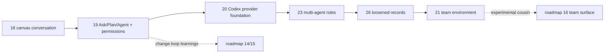

# EPIC — web2 operational collaboration: one builder → second provider → agent roles → team

**Status:** Active · **Owns:** the sequencing of the `web2` conversation track from read-only
explainer to a collaborative multi-agent, multi-human workspace · **Updated:** August 21, 2026

[Story 18](STORY-20260805-web2-agent-mermaid-canvas.md) proved the surface: a canvas-first,
session-persistent conversation over a local repository with a read-only agent. This epic owns
what comes next: make the conversation **operational** (modes, git history, permissioned
building), prove a safe **second provider** (Codex), compose providers into **multi-agent**
roles, then add **multiple humans**. Each proposed story follows the executable
[story template](TEMPLATE.md); Story 21 remains a sequencing-level draft until it is picked up.

Relation to the [north-star roadmap](EPIC-20260705-north-star-roadmap.md): this track began as
the experimental parallel one. It is no longer parallel —
[Story 24](STORY-20260820-promote-next-app-archive-legacy.md) promoted its application to the
repository root as **CodeAI** and archived the original visualizer runtime under
[`legacy/`](../legacy/README.md), and
[Story 25](STORY-20260821-next-16-npm-toolchain.md) moved that root package to npm and Next.js 16.
The stories below keep their historical `web2` names and prose; their source paths now resolve
under `src/`, and their `yarn …` commands are `npm run …` today. Story 19 feeds the change-loop learnings of roadmap
Stories 14–15 (intent → agent → proposed change, plan preview); Story 20 tests that contract
across providers; Story 23's roles and hand-offs inform the same; Story 21 is the experimental
cousin of roadmap Story 16 (team surface). Nothing here imports the archived `legacy/` runtime.

**Invariants** (hold across every story in this epic):

1. **Local-first, single desktop user until Story 21.** No remote hosting, no auth, and no
   multi-tenant assumptions leak in earlier.
2. **Bring-your-own agent auth.** Agents run through the user's own locally configured CLIs
   (`claude`, then `codex`). web2 never owns, injects, copies, or persists provider credentials.
   Provider capability configuration is server-owned and isolated from ambient executable
   integrations even though official CLI authentication is reused. Platform-managed keys or
   BYOK enter only with the team story.
3. **Capability floors never weaken.** Ask stays read-only; escalation is always an explicit
   per-message mode or explicit approval, server-owned end to end. A provider mode stays
   unavailable when it cannot meet that floor.
4. **Conversation outlives any provider session.** Story 20 separates the Cartograph thread id
   from a single provider session; Story 23 extends that record to N participants and authored
   messages. Provider sessions remain private working memory, never the canonical transcript.
5. **Every story is shippable alone.** A half-landed story must not strand the working
   read-only product, and one unavailable provider must not make another unusable.

---

## Story map

| # | Story | Theme | Status | Depends on |
|---|---|---|---|---|
| 18 | [web2-agent-mermaid-canvas](STORY-20260805-web2-agent-mermaid-canvas.md) | canvas-first read-only conversation | **In progress** — core shipped, experiment log open | — |
| 19 | [web2-conversation-modes](STORY-20260806-web2-conversation-modes.md) | Ask/Plan/Agent modes, git read allowlist, interactive permissions, env passthrough | **In progress** — implemented, real-agent smoke pending | 18 |
| 20 | [web2-codex-provider](STORY-20260817-web2-codex-provider.md) | provider/session separation, Codex App Server adapter, safe mode parity | **Shipped** | 19 |
| 23 | [web2-multi-agent-roles](STORY-20260817-web2-multi-agent-roles.md) | participants, authored deltas, manual handoffs, roles, cross-vendor peer review | **In progress** | 20 |
| 26 | [loosen-project-host-bindings](STORY-20260826-loosen-project-host-bindings.md) | thread attachments (0..n projects), host ids, session-keyed runs, N humans | **Draft** | 23 |
| 21 | [web2-team-environment](STORY-20260806-web2-team-environment.md) | multiple humans, server transcripts, auth, billing shift, sandboxing | **Draft** (sequencing) | 23 |
| 22 | [web2-sketch-canvas](STORY-20260807-web2-sketch-canvas.md) | blank sketch canvas, drawing as the first instruction | **Shipped** | 18 |

Story numbers reflect when the stories were created; dependency order is
`18 → 19 → 20 → 23 → 26 → 21`. Each core abstraction is the substrate of the next: mode policy →
provider/session boundary → participant model → loosened records → shared server state.

---

## Phases

### Phase 1 — Operational single agent (Story 19)

The conversation becomes useful for work, not just understanding: git/PR history in every
mode, Plan as an approvable artifact that hands off into execution in the same session, and
Agent building in the working tree behind inline permission cards.

**Exit:** *discuss → plan → approve → build → review diff* works end-to-end on one Claude
agent, on the user's own CLI auth, with tests green offline.

### Phase 2 — Codex provider foundation (Story 20)

Thread and provider session identity decouple; provider selection, health, configuration, and
copy become generic. A Codex adapter uses App Server's local stdio protocol for persistent
threads, streamed events, cancellation, and approvals. Ask/Plan must meet the read-only floor;
Codex Agent ships only after per-side-effect approval parity is demonstrated.

**Exit:** a user can choose Claude or Codex for a new single-agent conversation and complete
Ask → Plan → resume with the same canvas/artifact contract; every advertised mode passes its
safety gate.

### Phase 3 — Multi-agent roles (Story 23)

Messages gain authors and threads gain participants. Each agent owns a private provider
session; orchestrator/coder/reviewer/tester/custom roles are prompt presets with default modes,
and a separate mutable main-agent pointer chooses the default recipient. The user drives the
cross-vendor peer-review loop by addressing one agent per sequential turn or prefilling a
roster-aware quick handoff; nothing relays autonomously.

**Exit:** the spec → review → implement → review scenario completes with Claude and Codex in
one thread, attribution correct in transcript and export.

### Phase 3b — Loosened records (Story 26)

The persisted shapes stop asserting one project, one machine, one run, and one human. A thread
holds zero or more project attachments, records name the host that owns them, runs are keyed by
agent session, and both roster validators accept several humans. No behavior changes; the point is
to pay these migrations while the stored data is small, and to stop Phase 4 and the
[environment memo](../docs/multi-project-session-environment.md) from starting with a rewrite.

**Exit:** existing conversations migrate silently, the product loop is unchanged, and a
project-free thread can be created and persisted through the API.

### Phase 4 — Team (Story 21)

Other humans join: server-side transcripts, identity, per-thread rights (including who may
answer permission cards), and presence. Billing moves to API keys/BYOK; agent processes gain
OS sandboxing before anything listens beyond localhost.

**Exit:** two people on two machines share one live thread with agents, safely.

---

## Deliberately not scheduled

- **BYOK / provider-API-key billing before Story 21** — local CLI authentication is the product
  until then.
- **Autonomous multi-round orchestration** — Story 23 proves user-addressed sequential turns;
  agent-to-agent loops wait for evidence that the manual loop converges.
- **Worktree isolation and apply/discard checkpoints** — named in Story 18's expansion path;
  revisit after permission cards prove insufficient, at latest in Story 21's sandboxing.
- **Remote/multi-tenant hosting** — beyond even Story 21's small-trusted-team scope.

## Risks to watch

- **Codex protocol and safety drift.** App Server schemas are version-specific. Story 20 uses
  version-matched schemas as a reference, tolerates additive events, and fails modes closed
  when their sandbox/approval contract cannot be demonstrated; silent workspace write is not
  a fallback.
- **Ambient configuration bleed.** Reusing CLI auth must not silently enable MCP, plugins,
  skills, hooks, web search, subagents, or other terminal customizations. Story 20 makes
  isolation and effective-config verification an acceptance gate.
- **Vendor ToS drift.** Subscription use through vendors' own CLIs on the user's desktop is the
  intended local path, but terms evolve. The billing boundary at Story 21 exists partly for
  this.
- **Permission fatigue.** If Agent prompts too often, users will ask for blanket allows. Scoped
  persistent grants are deliberately deferred until they have their own security design.
- **Identity confusion in shared transcripts.** The identity preamble and authored deltas in
  Story 23 are load-bearing, not polish.
- **localStorage runway.** Multi-participant threads may hit browser storage limits before
  Story 21; Story 23 should pull server-side transcripts forward if measured usage requires it.

---
