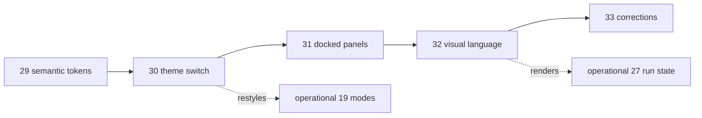

# EPIC — shell design system: tokens → themes → docked layout → visual language

**Status:** Active · **Owns:** the sequencing of the CodeAI shell's presentation layer from a
hardcoded light-only stylesheet to a themed, token-driven, canvas-first surface ·
**Updated:** August 28, 2026

The application's capability grew faster than its surface. At the start of this epic, the
stylesheet was one 425-line hand-written file whose palette was written inline — 18 custom
properties against **73 distinct hex literals and 49 `rgba()` values** across 135 selectors — so a
second theme was a rewrite rather than a diff. Stories 29 through 31 have now moved those values
into a shared token source, added the generated light/dark blocks, shipped a system-aware theme
switch, and replaced the panel overlays with responsive, resizable dock columns. The interface
font named in the stylesheet has still never been loaded; the visual-language pass is the one
remaining part of the epic.

This epic owns fixing that in an order where each step is safe. Colors become data, then the data
gets a second theme, then the layout stops covering the thing it exists to show, and only then does
anything change appearance. Each story follows the executable [story template](TEMPLATE.md).

Relation to the other epics: this one is **orthogonal**, not parallel. The
[operational collaboration epic](EPIC-20260806-web2-operational-collaboration.md) owns what the
product can *do* — modes, providers, participants, runs. This one owns how that capability is
presented. They meet at exactly two points, both of which are constrained by Invariant 3 below: the
run ribbon renders run state without changing the run protocol, and the mode selector restyles the
Ask/Plan/Agent escalation from Story 19 without changing its policy. Nothing here is a prerequisite
for anything there, or the reverse.

The direction is named **sheet and instrument**: the canvas is a sheet — the lightest surface in
either theme and the only place the eye should rest — and everything else is the recessed,
achromatic instrument around it. The reference mock lives at
[docs/design/sheet-and-instrument.html](../docs/design/sheet-and-instrument.html).

**Invariants** (hold across every story in this epic):

1. **One source of truth for color.** Every color value is written once, in
   `src/shared/design/tokens.ts`. `src/app/tokens.css` is generated from it and committed;
   `globals.css` never contains a color literal. A story that needs a new color adds a token — it
   does not add a literal, and it does not add a second palette. The Mermaid palette is included:
   it is the one place a duplicate palette already exists, and Story 30 removes it.
2. **The first two stories are foundational, not a redesign.** Story 29 changes no pixels. Story
   30 preserves the existing layout and visual language while adding the dark appearance; its one
   deliberate light-palette correction darkens the `live` state enough to meet WCAG AA wherever
   it is used as text or beneath light text. The visual restyle remains owned by Story 32.
3. **No protocol change. The design yields, not the contract.** This epic is frontend-only end to
   end: no route, no store, no `AgentEvent` field, no provider adapter. Where a visual idea wants
   data the protocol does not carry, the *idea* is reshaped to what the client already holds. The
   run ribbon is the worked example — it is a rolling activity trace rather than a progress bar
   because `tool-activity` has no call id, no completion event, and no total.
4. **The canvas is never occluded.** From Story 31 onward, no panel covers the sheet at docking
   widths, and anything that still floats publishes its footprint as a canvas inset that
   fit-to-view consumes. A feature that cannot honor this docks or does not ship.
5. **Both themes are first-class.** After Story 30, work lands in light and dark or it does not
   land. Theme blocks redefine custom properties only — a component style declared inside a
   `@media (prefers-color-scheme)` or `[data-theme]` block is the bug that renders one theme's
   text on the other theme's ground.
6. **What the agent receives never depends on appearance.** The composite PNG attached to a
   message, the prompt, and every stored artifact stay theme-independent. A user's appearance
   setting must never change what an agent is asked.
7. **Every story is shippable alone.** A half-landed epic must not strand the working product.

---

## Story map

| # | Story | Theme | Status | Depends on |
|---|---|---|---|---|
| 29 | [semantic-design-tokens](STORY-20260828-semantic-design-tokens.md) | tokens.ts as source of truth, generated tokens.css, literal-free globals.css | **Shipped** | — |
| 30 | [theme-switch](STORY-20260828-theme-switch.md) | light/dark/system, no-flash stamp, theme as an explicit Mermaid argument | **Shipped** | 29 |
| 31 | [dock-canvas-panels](STORY-20260828-dock-canvas-panels.md) | three-column grid, resizable rails, inset-aware fit, dock capacity bands | **Shipped** | 30 |
| 32 | [visual-language](STORY-20260828-visual-language.md) | Geist/Geist Mono/Archivo, 48px breadcrumb header, run ribbon, titleblock | **Shipped** | 31 |
| 33 | [visual-language-corrections](STORY-20260829-visual-language-corrections.md) | header overflow and flex sizing, one control height, hue discipline, Mermaid cScale | **Shipped** | 32 |

Dependency order is strictly `29 → 30 → 31 → 32`, and unusually for this repository the order is
not negotiable. Each story exists to make the next one small: 30 is a values change only because 29
removed the literals; 32 is a restyle rather than a rewrite only because 31 already fixed the
layout. Attempting 32 first would mean doing all four at once, which is the trap this sequence is
designed to avoid.

All five stories are shipped. Story 33 is the correction pass over the running application that
Story 32 could not do from the mock alone: the flaws it found are the ones that only appear at a
real viewport width, with real repository and transcript content in place.

---

## Phases

### Phase 1 — Colors become data (Story 29, shipped)

The palette moves out of the stylesheet into `src/shared/design/tokens.ts`, a side-effect-free
module that satisfies the existing `src/shared` constraint and that a future react-three-fiber
client can import without touching CSS. A generator projects it into a committed `tokens.css`; two
tests hold the line, one forbidding literals in `globals.css` and one asserting the committed
generated file matches a fresh generation.

**Exit met:** `grep` finds no color literal in `globals.css`, regeneration is a no-op, and the
shipped before/after screenshot comparison shows no visual difference.

### Phase 2 — The second theme (Story 30, shipped)

The generator emits dark values into the three-block pattern that handles all three viewer states —
explicit light, explicit dark, and un-stamped system. An inline script stamps `data-theme` before
first paint. Mermaid stops holding a global theme: `renderMermaid` takes the theme as an argument,
and renders serialize because `mermaid.initialize` is process-global.

This phase also fixes a correctness bug it uncovers rather than deferring it: the composite PNG
attached to agent messages reuses the cached SVG, so in dark mode the agent would receive a
dark-background image. It is rendered light regardless of theme, per Invariant 6.

**Exit met:** light, dark, and system all work with the pre-paint stamp and Strict Mode reapply;
diagrams repaint on switch without losing pan, zoom, or marks; blocked browser storage falls back
to System; and the decoded attachment payload is light while the visible canvas remains dark.
Verification completed August 28, 2026 with 147 Vitest tests, strict TypeScript, the default
production build, and all five Playwright scenarios passing.

### Phase 3 — The canvas stops being covered (Story 31, shipped)

Overlays become grid columns and the canvas reflows. Both rails resize within clamps; the diff
inspector gets an explicit strategy instead of widening its column to 920px; fit-to-view fits the
*visible* rect and re-centers for asymmetric insets rather than applying a `0.86` guess. Because
the three minimum widths cannot coexist at every viewport, docking is banded — two panels, one
panel, or overlay — derived from live column minimums rather than a hardcoded breakpoint.

This is the largest diff in the epic and the one users feel first. Shell-owned layout state now
derives the 640/960px capacity bands from the column minimums, persists clamped panel widths, and
collapses both side columns for focus mode. The canvas publishes the measured toolbar and control
footprints as CSS insets; fitted views follow panel changes while manually panned or zoomed views
stay put.

**Exit met:** with both panels open, no diagram element is covered by a panel, the toolbar, or the
zoom cluster; **Fit** centers the diagram in the visible rect; the three viewport bands behave as
specified; keyboard resizing persists; and focus mode restores the prior layout. Verification
completed August 28, 2026 with 151 Vitest tests, strict TypeScript, the default production build,
and all six Playwright scenarios passing. The browser suite directly asserts panel/canvas bounding
boxes, the inset-reduced fitted rect, persisted keyboard resizing, and the responsive bands.

### Phase 4 — It finally looks different (Story 32)

Geist, Geist Mono, and Archivo replace an unloaded font stack. The header drops to 48px with a
breadcrumb in place of four labelled pickers. Mode escalation is encoded rather than decorated —
Agent shares the `wait` token with pending approvals and permission cards, because they are the
same fact. The run ribbon becomes the app's only ambient motion, and the canvas gains a titleblock
composed from fields that already exist.

**Exit:** the running app matches the reference mock in both themes, all three faces are
self-hosted, the ribbon traces a real Agent-mode run including a denied call, and nothing animates
under `prefers-reduced-motion`.

---

## Deliberately not scheduled

- **Tailwind and shadcn/ui.** shadcn requires Tailwind; adopting it means rewriting every
  `className` across 2,360 lines of TSX for a component set that contributes nothing to the canvas,
  the ink layer, or the streaming transcript. Its actual good idea — semantic variables with a dark
  override — is plain CSS and is Story 29. Locking the design system inside a CSS framework would
  also put it out of reach of the planned react-three-fiber client, which cannot consume classes.
- **Radix primitives for the project popover and the agent menu.** Worth doing — the agent menu is
  a raw `
` today — but it is an accessibility change with its own test surface, and
  folding it into a restyle would make both harder to review. Its own story.
- **Per-call lifecycle for the run ribbon.** True segment completion needs `tool-activity` to carry
  a call id and a started/finished status, which changes `AgentEvent`, both provider adapters, and
  run orchestration. That is a full-stack story and would violate Invariant 3 here.
- **Naming a canvas.** The titleblock uses `ordinal` because `DiagramArtifact` has no name field.
  Adding one is a data-model and persistence change.
- **Spacing and type-scale tokens.** Colors are what block dark mode. The rest can follow when the
  VR client actually needs them, rather than being speculated now.
- **The VR client itself.** It imports `tokens.ts`; nothing in this epic anticipates it further.

## Risks to watch

- **The foundational-refactor review trap.** Stories 29 and 30 produced large diffs with little
  light-theme visual churn. They were the easiest place in this epic for an error to pass review.
  The parity, purity, contrast, and browser theme tests remain because human review alone will not
  catch a swapped token or a theme-specific render race.
- **Mermaid's global configuration.** `mermaid.initialize` is process-global and a no-op after the
  first call. Story 30 serializes renders for this reason; any later feature that renders a diagram
  at a non-active theme must go through the same queue or it will race the canvas.
- **The dock grid remains a regression boundary.** Story 31 rewrote the shell's layout, and the
  grid still depends on subtle `minmax(0, 1fr)` behavior that a wide row can silently defeat. Keep
  the Playwright panel/canvas bounding-box and responsive-band assertions whenever Story 32 moves
  or restyles shell chrome.
- **Font acquisition at build time.** `next/font/google` self-hosts the files but downloads them
  during the build. If offline builds matter, the fonts must be committed and loaded with
  `next/font/local`. Decide before Story 32 starts, since it changes what lands in the repository.
- **Mock drift.** [docs/design/sheet-and-instrument.html](../docs/design/sheet-and-instrument.html)
  is the verification oracle for Story 32. If the implementation diverges deliberately, update the
  mock in the same change — a stale oracle is worse than none.
- **Scope creep into the operational epic.** The ribbon and the mode selector both sit on the
  boundary. Invariant 3 is the test: if a visual idea needs a protocol field, the idea changes.

---
